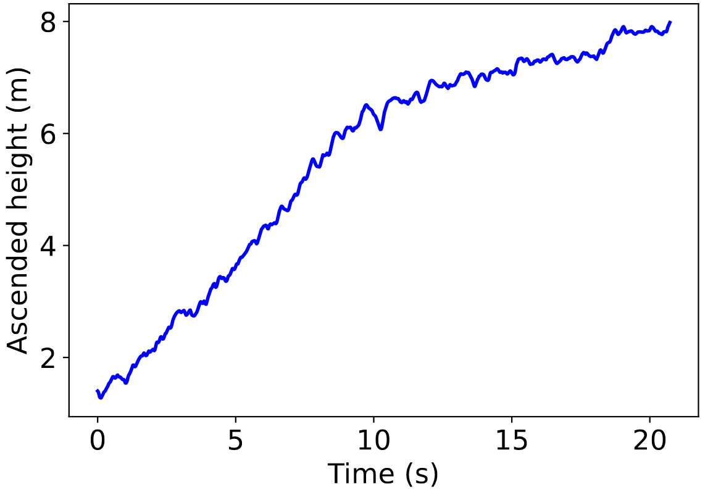

# Learn to climb: teaching a reinforcement learning agent the single rope ascending technique

Mujoco environment for a humanoid ascending a multibody rope, modeling the single rope climbing technique. The emvironment is used to teach a Soft-Actor-Critic reinforcement learning agent. 
The agent is borrowed from: https://github.com/pranz24/pytorch-soft-actor-critic

The environment is based on the [Humanoid-v2 OpenAI gym environment](https://github.com/openai/gym/blob/master/gym/envs/mujoco/humanoid_v4.py). It is extended with a multibody rope and the climbing gear. The multibody model consists of 123 bodies, and has 245 DoFs.

The goal in this environment is to ascend as high as possible. Reward is given equal to the height ascended (in milimeters) in a single step, and the episode terminates if the climber has reached 8 meters or the agent has interacted with the environment 5000 times.

The action space is a continuous all actions bounded in -0.4, 0.4, and each action represents the numerical torque applied at the hinge joint. Note that each actuated joint has limited rotation and a gear ratio so that each muscle can create realistic torques. The action space is simplified: not all joints are actuated, only the ones that are relevant for climbing to simplify learning and avoid parasite movements. The rest of the joints are left numb. The five actuated joints are the left hip, left knee, left shoulder (around the x and y axis), and left elbow. 

The observation space consists of positional values of different body parts of the Humanoid,
followed by the velocities of those individual parts (their derivatives) with all the positions ordered before all the velocities. The x- and y-coordinates of the torso are being omitted to produce position-agnostic behavior. Additionally, the coordinates of the torso is in the global coordinate while other body parts attached to it are in the local, coordinate system relative to the torso. In total, the observation space consists of 94 continous states. 

# Results

   

   
Learning process with 3 different random seeds

  

 

 
Ascended height during one episode

  

 
  

 
The agent in action

# Requirements

- Mujoco-py
- Gym
- Pytorch
- Numpy
- Pickle
- Matplotlib

# References

_For detailed description, see the paper with the same title._
